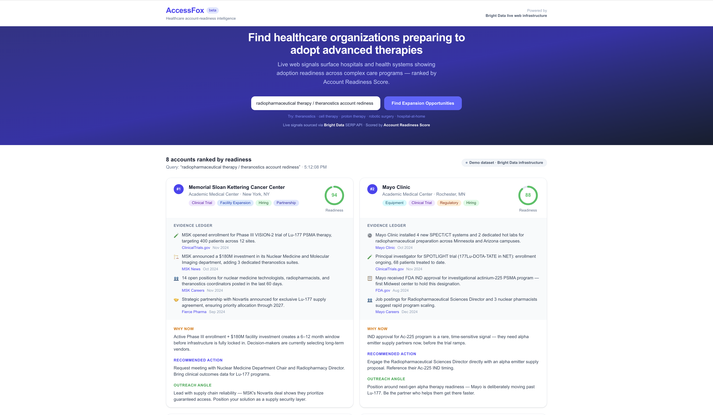

# AccessFox

**Healthcare account-readiness intelligence from live web signals.**

AccessFox helps enterprise GTM and strategy teams identify which hospitals and health systems are becoming ready to adopt advanced therapies — *before* that readiness shows up in CRM systems or static market reports.

**Live demo:** [accessfox.vercel.app](https://accessfox.vercel.app)



---

## What It Does

Hospitals send clear signals when they're preparing to adopt an advanced therapy: job postings, clinical trial registrations, facility investments, regulatory filings, partnership announcements. These signals are all public — but scattered across dozens of sources.

AccessFox pulls live public web signals via **Bright Data's SERP API**, processes them through an **AI enrichment layer (AIML API / GPT-4o)**, and returns ranked account intelligence cards:

| Output | Description |
|--------|-------------|
| **Account Readiness Score** | Signal-weighted 0–100 score per organization |
| **Evidence Ledger** | Sourced signals with dates and links to original pages |
| **Why Now** | Urgency rationale synthesized for a sales rep |
| **Recommended Action** | Specific next commercial step |
| **Outreach Angle** | The message framing most likely to land |

The demo ships with a radiopharmaceutical therapy / theranostics use case, but the pipeline is query-driven and works for any advanced healthcare market: cell therapy, proton therapy, robotic surgery, hospital-at-home, medical AI, and more.

---

## Hackathon

**Bright Data AI Agents & Web Data Hackathon**
Track: GTM Intelligence / Enterprise AI
Submission: [lablab.ai](https://lablab.ai/ai-hackathons/brightdata-ai-agents-web-data-hackathon)

---

## Bright Data Integration

AccessFox uses **Bright Data's SERP API** via residential proxy infrastructure to fetch live Google search results in real time — not cached, not static.

```
lib/brightdata.ts
```

- Proxy endpoint: `brd.superproxy.io:33335` (HTTPS)
- Transport: `undici` `ProxyAgent` with `proxyTls` and `requestTls` set to bypass Bright Data's TLS interception certificate
- Queries are dynamically built from the user's search term
- Returns up to 20 structured results with URLs and text excerpts
- Live badge visible in UI: **● Live Web Signals via Bright Data**
- Gracefully falls back to demo dataset when `BRIGHTDATA_PROXY_URL` is not set

---

## AI / ML Layer

```
lib/ai.ts
```

- Provider: **AIML API** (OpenAI-compatible endpoint)
- Model: **GPT-4o**
- Input: up to 15 URLs from Bright Data SERP results (filtered to hospital/health system domains)
- Processing: 3 parallel batches of 5 URLs each via `Promise.allSettled` (~15s vs ~55s sequential)
- Output: structured `Organization` objects with score, evidence, reasoning, and commercial intelligence
- 20-second timeout per batch; failures are isolated — partial results always returned

---

## Stack

| Layer | Technology |
|-------|-----------|
| Framework | Next.js 15 (App Router) |
| Language | TypeScript |
| Styling | Tailwind CSS |
| Live web data | Bright Data SERP API |
| AI enrichment | AIML API (GPT-4o) |
| HTTP proxy | undici ProxyAgent |
| Deployment | Vercel |

---

## Run Locally

**Prerequisites:** Node.js 18+

```bash
git clone https://github.com/dbaikov/bright-data-hack.git
cd bright-data-hack
npm install
npm run dev
```

Open [http://localhost:3000](http://localhost:3000). The app runs in **demo mode** with no environment variables — 8 fully-populated account cards are always rendered as a fallback.

### Enable Live Mode

Create `.env.local` in the project root:

```env
# Bright Data SERP API — residential proxy credentials
BRIGHTDATA_PROXY_URL=http://brd-customer-<id>-zone-serp_api1:<password>@brd.superproxy.io:33335

# AIML API key — https://aimlapi.com
AIMLAPI_KEY=your_key_here
```

With both variables set, the app fetches live Google search results via Bright Data and enriches them through GPT-4o. The UI badge switches from "Demo dataset" to **● Live Web Signals via Bright Data**.

---

## Project Structure

```
app/
  api/opportunities/route.ts   # POST endpoint — orchestrates Bright Data + AI
  page.tsx                     # Search UI with results grid

components/
  OrgCard.tsx                  # Account card: score, evidence, reasoning
  ScoreRing.tsx                # SVG circular score indicator
  DataSourceBadge.tsx          # Live vs demo mode badge
  SignalChips.tsx              # Signal type tags

lib/
  brightdata.ts                # Bright Data SERP proxy integration
  ai.ts                        # AIML API GPT-4o enrichment
  score.ts                     # Deterministic signal-weight scoring
  fallback.ts                  # 8-org demo dataset (always-available fallback)
  types.ts                     # Shared TypeScript types

submission/
  cover.png / cover.svg        # Cover image
  slides.pdf / slides.html     # 4-slide pitch deck
  accessfox-demo.mp4           # Demo video (78s)
  VIDEO_SCRIPT.md              # Narration script
```

---

## How Scoring Works

When live AI enrichment is not available, `lib/score.ts` computes a deterministic score from signal types:

| Signal | Weight |
|--------|--------|
| Clinical trial | 25 |
| Facility expansion | 20 |
| Equipment investment | 18 |
| Hiring | 15 |
| Regulatory | 12 |
| Partnership | 8 |
| Funding | 8 |

Bonuses applied for recency (signals dated within 90 days) and signal diversity (multiple signal types).

---

## Demo

**[accessfox.vercel.app](https://accessfox.vercel.app)**

1. Enter a therapy or market (e.g. `radiopharmaceutical therapy`, `cell therapy`, `hospital-at-home`)
2. Click **Find Expansion Opportunities**
3. Review ranked account cards with scores, evidence, and commercial intelligence
